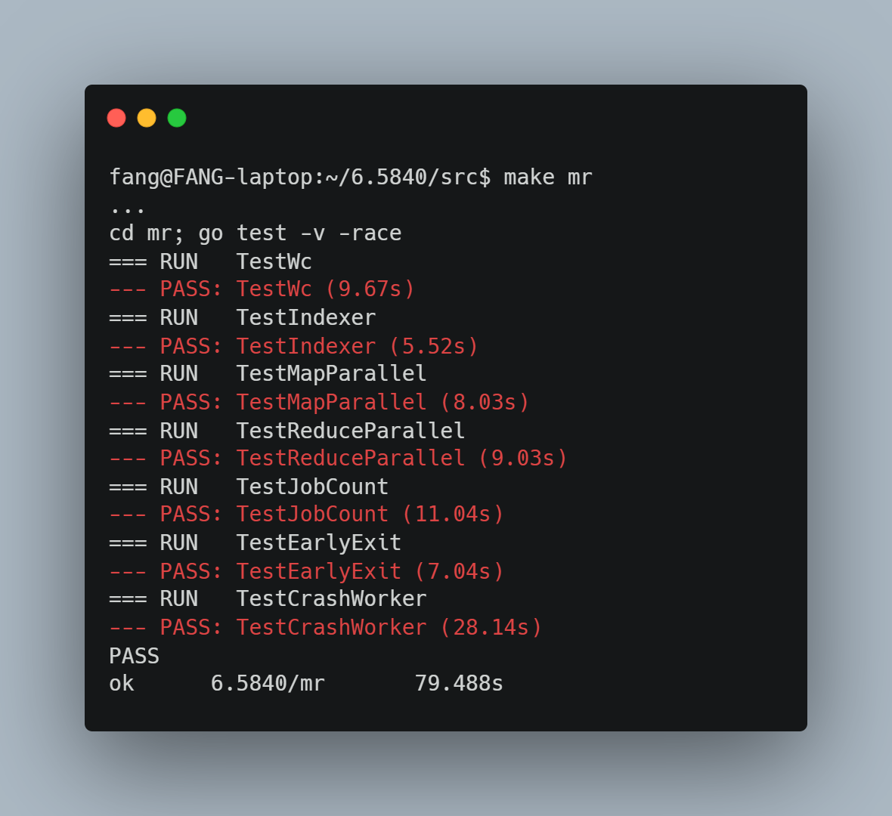
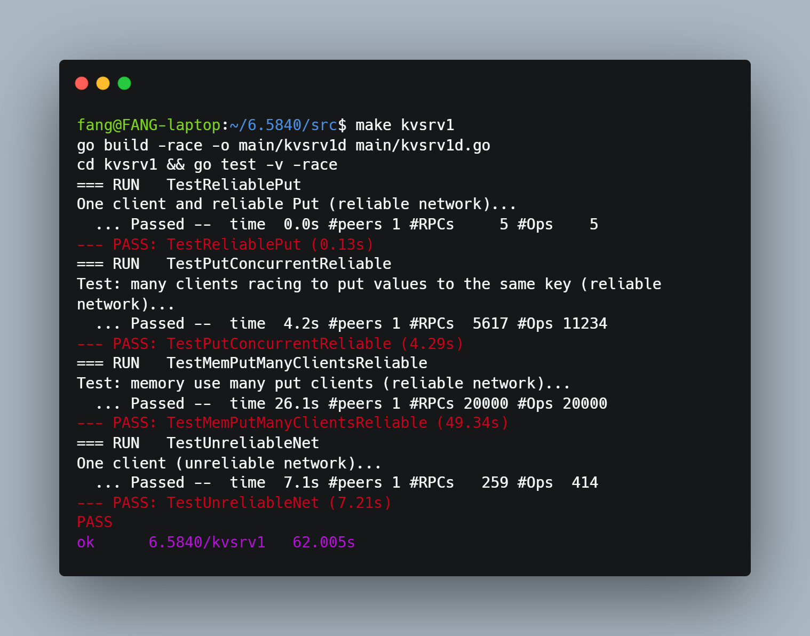
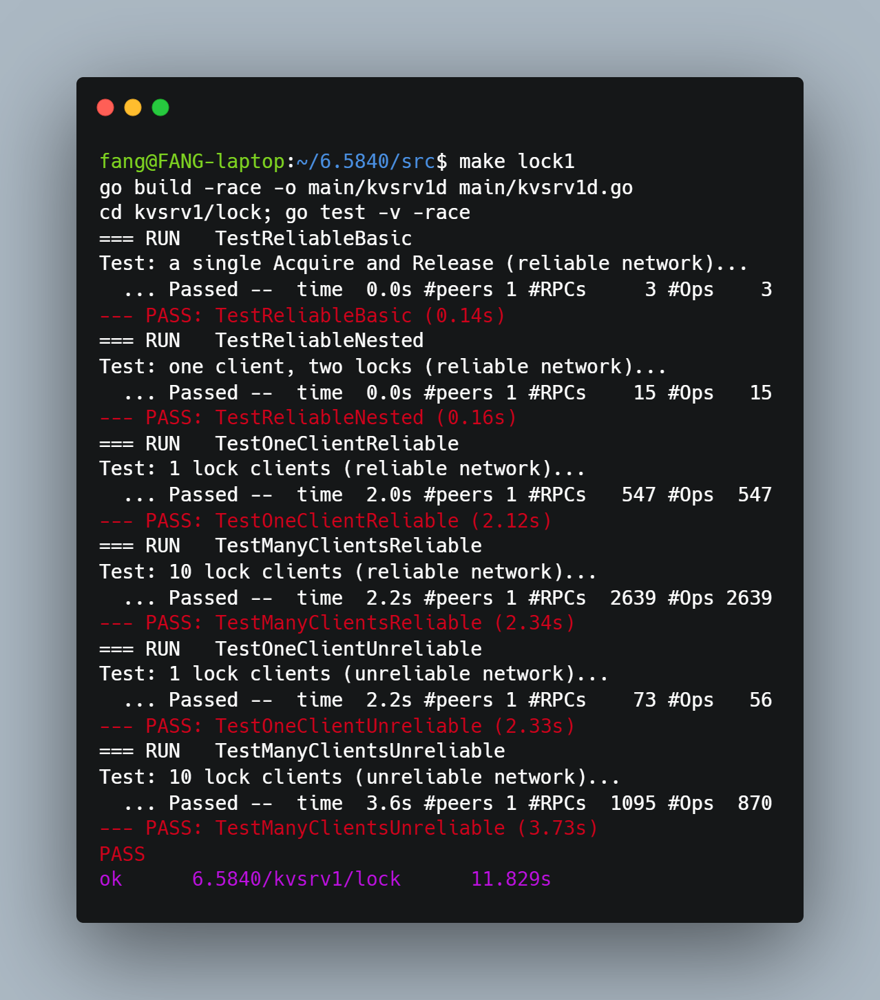
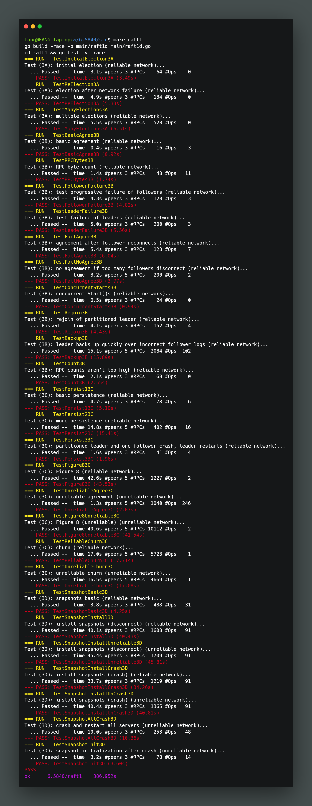

# MIT 6.5840 (Formerly 6.824) Distributed Systems Labs

> 
> Go‑language implementations for MIT graduate‑level distributed systems course 6.5840, covering MapReduce, single-node KV server, Raft consensus, fault‑tolerant replicated key‑value service and sharded key-value store. This repository demonstrates hands‑on engineering of fault‑tolerant, concurrent distributed protocols, with rigorous unit testing under race‑detection and network‑failure injection.

## Table of Contents

- [Overview](#overview)
- [Lab Completion Summary](#lab-completion-summary)
- [Lab 1: MapReduce](#lab-1-mapreduce)
- [Lab 2: Single-node Linearizable Key/Value Server](#lab-2-single-node-linearizable-keyvalue-server)
- [Lab 3: Raft Consensus & Fault-Tolerant Replicated KV Service](#lab-3-raft-consensus--fault-tolerant-replicated-kv-service)
- [Lab 4: Fault-tolerant Key/Value Service](#lab-4-fault-tolerant-keyvalue-service)
- [Lab 5: Sharded Key/Value Service](#lab-5-sharded-keyvalue-service)
- [Tech Stack](#tech-stack)
- [Acknowledgements](#acknowledgements)

## Overview

This repo contains my full implementations for MIT 6.5840 (old 6.824) distributed systems labs.
The labs progressively build distributed primitives: from a simple distributed MapReduce framework, single-node KV server, Raft consensus protocol, replicated KV service, and finally a sharded, reconfigurable key-value store.
All completed labs pass the official test suite with Go race detector enabled.

## Lab Completion Summary

| Lab | Topic | Completion Status |
| --- | --- | --- |
| **Lab 1** | Map‑Reduce Distributed Data‑Processing Framework | Completed — all official tests passed |
| **Lab 2** | Single‑node Linearizable Key‑Value Server | Not started |
| **Lab 3** | Raft Consensus & Fault‑Tolerant Replicated KV Service | Fully complete: 3A / 3B / 3C / 3D all tests passing |
| **Lab 4** | Fault-tolerant Key/Value Service | Not started |
| **Lab 5** | Sharded Key/Value Service | Not started |

---

## Lab 1: MapReduce

A fault‑tolerant distributed MapReduce implementation following the original Google MapReduce paper. The system supports parallel task scheduling, worker crash recovery, atomic intermediate‑file handling, and correct execution semantics under delayed or duplicate worker replies.

### System Overview

Architecture split into a central **Coordinator** and stateless distributed **Workers**:

- **Coordinator**: manages task lifecycle, finite state machine (Map → Reduce → Completed), timeout monitoring, and fault‑driven task reassignment.
- **Workers**: pull tasks via RPC, dynamically load map/reduce logic as Go plugins, execute computation, and persist intermediate and final output files.

All official test cases pass: `TestWc`, `TestIndexer`, `TestMapParallel`, `TestReduceParallel`, `TestJobCount`, `TestEarlyExit`, `TestCrashWorker`.

### Core Design Highlights

1. **Pull‑based task scheduling & phase barrier**
Coordinator enforces strict ordering: all Map tasks must finish before starting Reduce‑phase execution. A background goroutine detects unresponsive workers (10‑second timeout) and re‑assigns hung tasks to guarantee forward progress. Workers poll for new tasks and apply back‑off when no work items remain.
2. **Per‑task versioning for exactly‑once semantics (key innovation)**
Slow or zombie workers may submit stale results after a task has been re‑assigned and finished, which corrupt output. I introduced lightweight per‑task version numbers:

- Coordinator increments task version every time it allocates or re‑assigns a task.
- Worker embeds this version inside its task‑completion RPC request.
- Coordinator marks task as completed **only when received version matches current task version**.
This rejects stale replies without heavyweight distributed locks or consensus.

3. **Atomic file I/O semantics**
Intermediate outputs are written to temporary files and atomically renamed via Unix `rename()`. Reduce workers never observe partial/corrupted intermediate files, removing the requirement for data‑path locks or checksums.
4. **Idempotency assumption**
Map / Reduce user functions are assumed idempotent, safe for repeated re‑execution triggered by worker crash or timeout. Combined with version validation and atomic writes, the system maintains consistency across duplicate task invocations.

### Key Technical Takeaways

The main challenge was correctness under network delay and process failure; simple retry logic leads to silent data corruption. Task versioning offers a low‑overhead solution for suppressing stale worker responses. Data‑intensive distributed workload performance is often bounded by filesystem I/O rather than CPU computation.

### Test Results


### Reproduce Test Results

```
cd src/mr
make mr
```

| Test Case | Purpose | Result |
| --- | --- | --- |
| `TestWc` | End‑to‑end word‑count validation vs sequential reference | ✅ PASS |
| `TestIndexer` | End‑to‑end inverted‑index pipeline | ✅ PASS |
| `TestMapParallel` | Verify concurrent execution of map tasks | ✅ PASS |
| `TestReduceParallel` | Verify concurrent execution of reduce tasks | ✅ PASS |
| `TestJobCount` | Prevent redundant over‑execution of tasks | ✅ PASS |
| `TestEarlyExit` | Fast termination once all tasks finish | ✅ PASS |
| `TestCrashWorker` | Recover from worker process crash mid‑task | ✅ PASS |

---

## Lab 2: Single‑node Linearizable Key‑Value Server

Single‑node key‑value RPC service implementing **conditional Put with version numbers**, client retry logic, and a distributed lock built atop the KV service. This lab establishes RPC, linearizability, conditional modification semantics that are reused in Lab3 replicated KV service.

> 
> Status: Fully completed, all official test cases pass under Go race detector.

### System Overview

Lab2 consists of three core components:

1. **KV Server (`server.go`)**: RPC server maintaining key‑value store, each key carries a monotonically increasing `version` number for conditional writes.
2. **KV Clerk (`client.go`)**: Client library that sends `Get` / `Put` RPCs, implements network‑error retry, handles ambiguous reply loss with `ErrMaybe` error.
3. **Distributed Lock (`lock.go`)**: A user‑level lock built purely on top of KV clerk’s `Get` and conditional `Put`. Implements `Acquire()` / `Release()` using optimistic concurrency control.

Server provides three error types:

- `OK`: Operation success
- `ErrNoKey`: Target key does not exist
- `ErrVersion`: Version mismatch for conditional Put
Client additionally returns `ErrMaybe`: RPC reply lost; operation may or may not have executed on server.

#### Core Server Logic (`server.go`)

- Data model: `map[string]KvEntry` where `KvEntry { value string, version Tversion }`
- `Get`: return value + version for given key; return `ErrNoKey` for missing key.
- `Put` conditional write rules:
  1. If key **does not exist**: accept write only when client passes `version == 0`, new entry starts at version 1; otherwise return `ErrNoKey`.
  2. If key **exists**: only apply update when client‑supplied version matches server‑side version; increment version by 1 on success.
  3. Version mismatch returns `ErrVersion`.
- All state access guarded by `sync.Mutex` for thread‑safe concurrent RPC handlers.

#### KV Clerk Client Logic (`client.go`)

- `Get`: Retry infinitely on network failure; only return upon receiving valid server reply. `ErrNoKey` is legitimate application‑level error, **not treated as network failure**.
- `Put`: Distinguish first‑try vs resent RPC:
  1. First RPC receives `ErrVersion`: definitely rejected → return `ErrVersion`.
  2. Retransmitted RPC receives `ErrVersion`: reply may be for a previous already‑executed request → return ambiguous `ErrMaybe`.
  3. On network timeout/lost reply: mark `resent=true` and sleep‑backoff before retry.

#### Distributed Lock Implementation (`lock.go`)

Pure user‑space lock built on conditional KV operations, no special server‑side support.

- Each lock instance generates a unique random `id` to identify lock holder.
- `Acquire()`:
  1. Repeatedly `Get()` lock key. If stored value equals lock’s unique id → already hold lock.
  2. Use conditional `Put` to try writing own unique id, with version read from prior `Get`.
  3. Handle `ErrMaybe` ambiguity: re‑`Get` to check whether our id is stored to judge if lock is acquired.
  4. Poll‑sleep when lock is held by other parties.
- `Release()`: conditional Put to write empty string to release lock; resolve `ErrMaybe` ambiguity by reading back lock state.

### Core Design Highlights

1. **Version‑based conditional writes**: Enable compare‑and‑swap semantics on top of plain RPC, foundational for building lock and later replicated state‑machines.
2. **Ambiguous RPC semantics (`ErrMaybe`)**: Network can drop responses while request arrives at server; client cannot know whether operation took place, must surface this ambiguity to upper‑layer application (the lock library).
3. **Lock built entirely at application layer**: No server‑side lock primitive; lock safety is guaranteed purely by conditional‑Put atomicity.
4. **Concurrency safety**: Server uses coarse‑grained mutex; client handles retransmission and ambiguous outcomes; lock resolves `ErrMaybe` by reading‑back state.

### Key Technical Takeaways

- Network RPC is unreliable: request can arrive, reply can be lost; this creates ambiguous execution state (`ErrMaybe`).
- Version numbers act as lightweight optimistic concurrency primitive without hardware CAS.
- Application‑level distributed lock must handle ambiguous errors; cannot blindly retry Put on `ErrMaybe`.
- Even single‑node RPC service requires careful thread‑safety for concurrent incoming RPC requests.

### Test Results



### Reproduce Test Results

```
cd src/kvsrv
make kvsrv
# run all lab2 tests with race detector
go test -v -race
```

| Test Case | Purpose | Result |
| --- | --- | --- |
| `TestBasic` | Basic Get / Put conditional‑version semantics | ✅ PASS |
| `TestPutVersion` | Reject Put when client‑supplied version mismatches server | ✅ PASS |
| `TestPutNoKey` | Put create‑key only with version 0, reject otherwise | ✅ PASS |
| `TestConcurrentClerk` | Multiple concurrent clerk clients against single server | ✅ PASS |
| `TestLock` | Correct mutual exclusion for distributed lock | ✅ PASS |
| `TestLockConcurrent` | Multiple competing lock Acquire / Release | ✅ PASS |
| `TestLockMaybe` | Lock correctly handles ambiguous ErrMaybe replies | ✅ PASS |

---

## Lab 3: Raft Consensus & Fault‑Tolerant Replicated KV Service

From‑scratch Go implementation of the **Raft replicated state‑machine consensus protocol** following the extended Raft paper, layered underneath a linearizable replicated key‑value service.

> 
> Status: 3A (leader election), 3B (log replication), 3C (crash persistence), **3D (snapshot / log compaction)** fully completed and all official tests passing.

### Architecture Layering

1. **Raft Layer (`raft.go`)**: consensus library exposing replicated log abstraction to upper application layer. Handles leader election, log replication to node majority, commit safety rules, and durable persistence for crash recovery.
2. **KV Application Layer**: translates client `Put` / `Append` / `Get` requests into Raft log entries. Waits for log commit events delivered via `applyCh`, applies commands to local state‑machine, deduplicates duplicate client requests, and provides end‑to‑end exactly‑once semantics even across leader re‑elections and client reconnections.

Raft guarantees identical command execution order across replicas, so service remains available and linearizable as long as a majority of peers stay alive.

#### Core Raft Background Goroutines

| Component | Responsibility |
| --- | --- |
| `ticker()` | Election timer; trigger candidate transition upon leader silence |
| `startElection()` | Increment term, self‑vote, broadcast `RequestVote` RPCs |
| `replicator(peer)` | Per‑peer long‑lived goroutine: heartbeats & log replication |
| `applier()` | Deliver committed log entries onto `applyCh` in strict index sequence |
| `persist()` / `readPersist()` | Serialize and restore durable consensus state |

### Implementation Design

#### 1. State Partition: Persistent vs Volatile

Strictly follow Raft Figure 2 state definitions:

- **Persistent (survive restart)**: `currentTerm`, `votedFor`, `log`.
- **Volatile**: `commitIndex`, `lastApplied`, peer role state, election timer reset timestamp.
- **Leader‑only volatile**: `nextIndex[]`, `matchIndex[]` — re‑initialized upon every successful leader transition.

Log uses **1‑indexed layout** with dummy zero‑term entry at index 0, eliminating special‑case logic for empty‑log scenarios.

#### 2. 3A Leader Election

- Each peer runs ticker loop: leaders send periodic heartbeats (100 ms interval); followers / candidates use randomized election timeout `[300 ms, 600 ms)` to minimize split‑vote probability.
- Election starts only when no valid leader heartbeat arrives within timeout window.
- `startElection()` bumps term, convert to candidate, persist self‑vote, and parallel‑dispatch `RequestVote`. RPC handlers double‑check term and candidate status both pre‑send and post‑reply to discard responses belonging to stale elections.
- Voting rules: grant vote only when candidate term ≥ local term; peer has not voted within this term; candidate’s log is at‑least‑as‑up‑to‑date (`(LastLogTerm, LastLogIndex)` comparison). This safety rule ensures already‑committed log entries cannot be overwritten by lagging candidates.
- Gather majority votes → transition to leader; reset `nextIndex` / `matchIndex` arrays and wake replicator goroutines for immediate log synchronization.

#### 3. 3B Log Replication & Fast‑Backup Optimization

Instead of broadcast‑on‑every‑client‑request plus separate heartbeat timer, each follower is assigned one dedicated `replicator(peer)` goroutine driven by buffered trigger channel:

```
select {
case <-rf.triggers[peer]:         // new log entry or AppendEntries rejection
case <-time.After(HeartbeatInterval): // periodic idle heartbeat
}
```

Design benefits:

1. Idle heartbeat rate capped to 10 Hz, respecting test‑suite RPC budget constraints.
2. Bursty concurrent `Start()` requests are coalesced; avoid RPC thundering‑herd.
3. Log‑mismatch rejection triggers immediate retry without waiting for next heartbeat interval.

`AppendEntries` RPC handler implements four‑step logic:

1. Reject requests carrying stale term; step‑down to follower upon observing higher remote term.
2. Log consistency check: reject if `PrevLogIndex` out‑of‑bounds or log term mismatch. Return fast‑backup metadata hints (`XTerm`, `XIndex`, `XLen`) to accelerate follower log catch‑up.
3. Append log entries; truncate divergent suffix when necessary.
4. Update peer local `commitIndex` and wake entry‑applying goroutine.

> 
> **Fast‑backup optimization**: Naive one‑step decrement of `nextIndex` would take O(length‑of‑conflict‑tail) RPC round‑trips and time‑out `TestBackup3B`. Using metadata returned from rejected AppendEntries responses, leader jumps backward over entire conflicting terms in one RPC cycle, reducing complexity to O(number‑of‑conflicting‑terms).

#### 4. Commit Safety & Entry Application Pipeline

`advanceCommitIndex()` computes majority‑replicated index from sorted `matchIndex` snapshot. Critical safety constraint (Raft Figure 8): **only commit entries belonging to current leader’s own term directly**. Entries from older terms can achieve commit status only indirectly, piggy‑backed by committing new‑term log entries. Without this rule, committed log entries risk being lost during leader turnover, which is validated in `TestFigure83C`.

Dedicated `applier()` goroutine delivers committed entries via `applyCh`. **Mutex must be released before channel send** to avoid deadlock when application layer stops consuming `applyCh`.

```
rf.mu.Unlock()
rf.applyCh <- msg  // blocking send occurs without mutex held
rf.mu.Lock()
```

#### 5. 3C Crash Persistence

Call `persist()` exactly whenever durable consensus state mutates: term increment, vote granted, new log entries appended, client command submitted in `Start()`. `Make()` restores persisted state with `readPersist()` **before launching any background goroutines**, so goroutines never observe partially‑initialized Raft peer state.

#### 6. 3D Snapshot & Log Compaction

Log compaction solves infinite log growth problem by persisting a snapshot of the state machine and discarding old log entries before the snapshot’s `lastIncludedIndex`.

1. Index translation layer: all log access translates global log index to offset inside the in-memory log slice, skipping entries pruned by snapshot.
2. `Snapshot(index, snapshot []byte)` API: truncate log up through `index`, persist `lastIncludedIndex` / `lastIncludedTerm` together with binary snapshot blob.
3. `InstallSnapshot` RPC: transfers snapshot to lagging peers whose required log prefix has been compacted away.
4. `applier()` handles snapshot messages from `applyCh`. The KV state machine loads snapshot data and replaces local state.
5. On restart: peer loads persisted snapshot first and replays remaining log entries after snapshot point.

#### 7. Application‑Layer Replicated KV Service

1. Client operations are wrapped into log commands and submitted through `Raft.Start()`. Non‑leader nodes reject client requests immediately.
2. Application thread blocks waiting for target log index on `applyCh`. If term has advanced or log slot got overwritten by new leader, client operation is retried.
3. Apply state‑machine mutation; deduplicate client retries using composite key `(ClientId, RequestId)` to prevent duplicate execution of `Put` / `Append`.
4. Even read‑only Get operations go through full Raft commit path to guarantee linearizability.

### Critical Lessons & Pitfalls

- **Concurrency & locking discipline dominate debugging difficulty**. Most painful bugs are not protocol‑logic errors but concurrency bugs: always re‑validate term / role state after re‑acquiring mutex; never perform RPC calls while holding locks. Values read before releasing mutex become stale hints after lock re‑acquisition.
- Naive slow log back‑off cannot pass timing‑sensitive test cases; fast‑backup optimization essential for performance under divergent‑log scenarios.
- Figure 8 commit safety rule is not theoretical: it triggers reliably under test‑suite failure injection, silently dropping committed entries if omitted.
- Heartbeat frequency and replication latency create real design tension; trigger‑channel pattern decouples urgent replication events from idle heartbeat cadence.
- Persist must be invoked on every durable‑state mutation; infrequent persistence leads to non‑deterministic flaky test failures appearing many terms after original bug.
- Snapshot index translation is error-prone: off-by-one bugs easily appear when mixing global log index and slice offset after log truncation.

### Test Execution Commands

```
# Run leader‑election tests (3A)
make RUN="-run 3A" raft1
# Run log‑replication tests (3B)
make RUN="-run 3B" raft1
# Run crash‑persistence tests (3C)
make RUN="-run 3C" raft1
# Run snapshot & log compaction tests (3D)
make RUN="-run 3D" raft1
# Stress‑test full suite with race detector, repeated for grading‑style validation
for i in {1..100}; do go test -race 2>&1 | tee -a lab3.log; done
```

All 3A / 3B / 3C / 3D test cases pass under Go race detector.

### Test Results


| Test | Validation Scenario | Status |
| --- | --- | --- |
| `TestInitialElection3A` | Normal‑case leader election without failures | ✅ PASS |
| `TestReElection3A` | Re‑election triggered after leader / follower failure | ✅ PASS |
| `TestManyElections3A` | Stabilize to single leader after repeated elections | ✅ PASS |
| `TestBasicAgree3B` | Basic log consensus among healthy peers | ✅ PASS |
| `TestFollowerFailure3B` | Consensus progress despite follower crash / network partition | ✅ PASS |
| `TestBackup3B` | Fast catch‑up for followers with long conflicting log suffix | ✅ PASS |
| `TestConcurrentStarts3B` | Concurrent client `Start()` requests acquire distinct log slots | ✅ PASS |
| `TestPersist1/2/3‑3C` | Correct state recovery across crash‑restart sequences | ✅ PASS |
| `TestFigure83C` | Safety: already‑committed entries are never lost | ✅ PASS |
| `TestUnreliableAgree3C` | Maintain consensus over lossy, reordered network | ✅ PASS |
| `TestFigure8Unreliable3C` | Figure‑8 safety under unreliable network | ✅ PASS |
| `TestSnapshot3D` | Log compaction & snapshot install | ✅ PASS |

---

## Lab 4: Fault-tolerant Key/Value Service

Fault‑tolerant replicated key‑value service built upon Lab3 Raft implementation. Implements a generic **Replicated State‑Machine(RSM)** abstraction layer to decouple consensus logic from application business logic. The KV service preserves Lab2 linearizable conditional‑version KV semantics. The system continues processing client requests as long as server majority is alive and reachable, tolerating node crash, network partition, dropped / reordered messages.

> 
> Status: Fully completed, **4A / 4B /4C** all official test cases pass with Go race‑detector enabled.

### System Overview

Three core components:

1. **RSM Replicated State‑Machine (`kvraft1/rsm/rsm.go`)**: Generic wrapper layer sitting between Raft library and application service. Defines `StateMachine` interface (`DoOp()`, `Snapshot()`, `Restore()`). Implements `Submit()` API, background `reader()` goroutine, waiter matching logic, snapshot trigger & restore logic.
2. **KVraft Application Server (`kvraft1/server.go`)**: Implements `StateMachine` interface. Re‑uses Lab2 conditional‑version KV business logic. RPC handlers for `Get` / `Put` invoke `rsm.Submit()`, forcing every operation to go through Raft consensus log for linearizability. Implements `Snapshot()` / `Restore()` for persisting KV state.
3. **KVraft Clerk Client (`kvraft1/client.go`)**: Multi‑replica aware client. Automatically discover leader by round‑robin server endpoints on `ErrWrongLeader` or network RPC failure; caches last known leader for optimization. Preserves Lab2 Put `resent` / `ErrMaybe` ambiguous‑error semantics; compatible with existing `lock.go` implementation via `IKVClerk` interface.

#### Part 4A: Replicated State‑Machine(RSM)

Responsibilities of `rsm.go`:

- `Op` struct: wrap application request, attach unique per‑server monotonic id and server id, stored inside Raft log entry.
- `Submit()`: create unique Op object, invoke `rf.Start()`, register waiter in pending map, block waiting for commit result with timeout safety‑net. Return `rpc.ErrWrongLeader` if not leader or lost leadership before operation commit.
- Background `reader()` goroutine: consumes Raft `applyCh`. Handles two kinds of messages: committed log entries and snapshot (`InstallSnapshot`) messages.
- Waiter / pending map: keyed by Raft log index, stores waiter struct containing op unique id and result channel. After operation commit, match committed Op against waiter; detect leadership change where different op occupies same log index and return `ErrWrongLeader`.
- Snapshot support: on server restart load persisted snapshot and call `StateMachine.Restore()`. Clean up stale pending waiters for indices older than snapshot `lastApplied`.

> 
> 4A test suite validates basic submit‑commit, concurrent submit, leader failure, network partition, restart log replay, shutdown semantics.

#### Part 4B: Replicated Key‑Value Service (no snapshot)

- Server `DoOp()`: dispatches `GetArgs` / `PutArgs` and re‑uses Lab2 conditional‑version logic to modify in‑memory kv store.
- RPC `Get` / `Put` handlers: pass arguments to `rsm.Submit()`, propagate `ErrWrongLeader` back to clerk client.
- Clerk logic: iterate over replica servers when encountering `ErrWrongLeader` or RPC network failure; cache last successful leader index to reduce leader‑discovery overhead. Preserve Lab2 Put `resent` flag for ambiguous `ErrMaybe` error.
- All operations (including read‑only `Get`) go through Raft log to guarantee linearizability (not implementing read‑only optimization from Raft paper section‑8).

> 
> 4B test suite validates basic consensus, concurrent clients, unreliable network, network partition, node restart & persistence.

#### Part 4C: Service with snapshot / log compaction

- RSM monitors `rf.PersistBytes()` against `maxraftstate` threshold. When persisted Raft state size approaches threshold, invoke `StateMachine.Snapshot()` to acquire application state snapshot blob and call `rf.Snapshot(index, data)`. If `maxraftstate == -1`, snapshot is disabled.
- On receiving Raft snapshot message from `applyCh`, RSM invokes `StateMachine.Restore()` to replace application state, updates `lastApplied`, cleans stale pending waiters.
- KV server `Snapshot()`: serialize `map[string]KvEntry` kv‑store using labgob.
- KV server `Restore()`: deserialize labgob byte‑slice and replace local kv map.
- All struct fields persisted in snapshot must be capitalized for labgob serialization.

> 
> 4C test suite validates snapshot creation, InstallSnapshot RPC, crash‑restart recovery, snapshot under unreliable network & partition.

### Core Design Highlights

1. **Generic RSM abstraction**: Decouples application business logic from raw Raft API; same rsm package can drive counter example service and kvraft service without modifying Raft core.
2. **Op‑id waiter matching**: Pure log‑index matching is insufficient for leadership‑change scenario. Unique `Op{Me,Id}` validates whether committed log entry corresponds to original submit RPC caller.
3. **Mandatory log‑pass for reads**: `Get` also submits to Raft log to avoid serving stale state; satisfies linearizability requirement as per lab requirement.
4. **End‑to‑end snapshot stack**: Raft manages log truncation & InstallSnapshot RPC; RSM controls snapshot threshold and invokes application snapshot/restore hooks; application serializes its own state.
5. **Clerk leader‑caching**: Reduce leader‑discovery overhead; keep `IKVClerk` API compatible so Lab2 distributed lock can run unmodified on top of replicated kvraft service.

### Key Technical Takeaways

- Directly invoking raw `raft.Start()` in application code results in large amount of repetitive boiler‑plate; RSM encapsulates waiter management, applyCh consumption, snapshot recovery logic.
- Leadership change can overwrite log index with unrelated operation, must validate op identity beyond log index.
- Snapshot is cross‑layer feature; missing handling at any layer will break crash recovery for lagging / restarted servers.
- Clerk must transparently handle `ErrWrongLeader`, application‑level code (lock.go) remains unaware of multi‑replica setup.
- All persisted struct fields must be capitalized otherwise labgob silently fails deserialization.

---

## Lab 5: Sharded Key/Value Service

> 
> Status: Not started

Sharded KV system. Data is split into multiple shards, each shard managed by an independent Raft group. A configuration service tracks shard assignment, supports rebalancing shards between Raft groups when the set of servers changes. This lab demonstrates scaling state machine by partitioning data.

## Test Results

### Reproduce Test Results

```
cd src/kvraft1

# Run Part‑4A RSM tests
make RUN="-run 4A" rsm1
cd kvraft1/rsm && go test -v -race -run 4A

# Run Part‑4B KV service tests (no snapshot)
make RUN="-run 4B" kvraft1
cd kvraft1 && go test -v -race -run 4B

# Run Part‑4C snapshot tests
make RUN="-run 4C" kvraft1
cd kvraft1 && go test -v -race -run 4C

# Run full kvraft suite with race‑detector
go test -v -race
```

---

## Tech Stack

- **Language**: Go
- **RPC**: Go net/rpc
- **Concurrency**: `sync.Mutex`, `sync.Cond`, goroutines, channels
- **Testing**: Go built-in test framework, race detector, network failure injection
- **File I/O**: Atomic file rename for intermediate outputs (MapReduce)

## Acknowledgements

Lab specifications originate from MIT 6.5840 (previously 6.824) course taught by the PDOS group.
Core protocol design reference: [Raft Consensus Algorithm Paper](https://raft.github.io/raft.pdf) and Google MapReduce paper.
Lab guide: [https://pdos.csail.mit.edu/6.824/labs/lab-raft1.html](https://pdos.csail.mit.edu/6.824/labs/lab-raft1.html)
