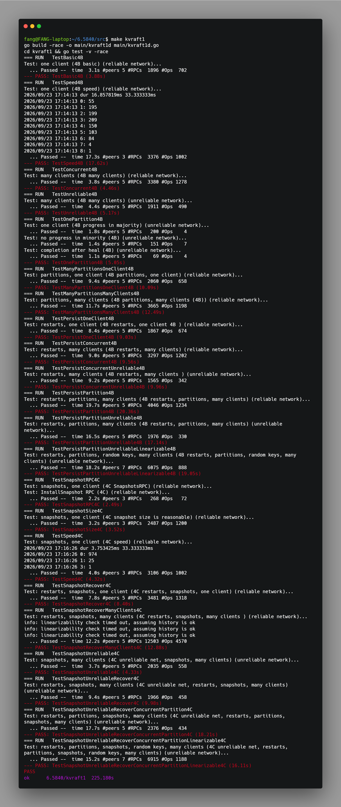
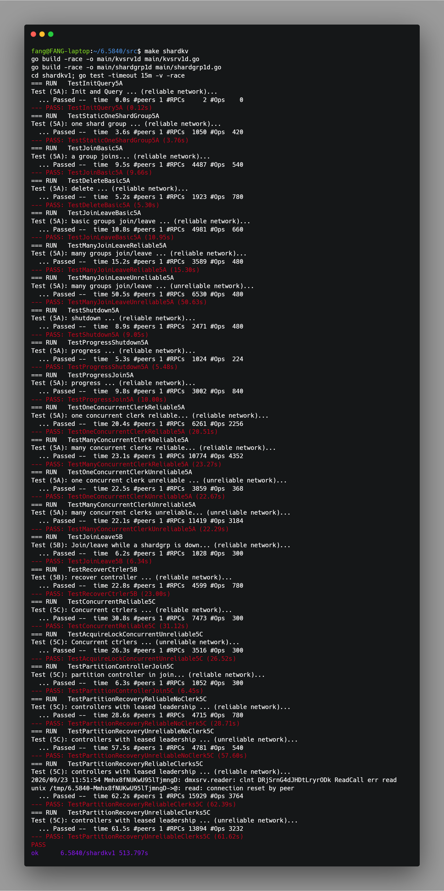

# MIT 6.5840 Distributed Systems Labs

This repository contains my Go implementations for the MIT 6.5840 (formerly 6.824) Distributed Systems laboratory sequence. It develops a progression of fault-tolerant systems: a MapReduce framework, a linearizable key/value service, the Raft consensus protocol, a reusable replicated-state-machine abstraction, and a dynamically reconfigurable sharded key/value store.

The project was developed against the course-provided test framework, which injects server crashes, restarts, network partitions, dropped and reordered RPCs, and concurrency stress. The completed components are exercised with Go's race detector. More importantly, the repository is intended to document the design reasoning behind the implementations: how safety properties are preserved while the systems continue to make progress in the presence of failures.

**Technical focus:** Go | RPC systems | concurrency | consensus | persistence | fault tolerance | distributed reconfiguration

## Contents

- [Completion summary](#completion-summary)
- [Repository structure](#repository-structure)
- [Engineering scope](#engineering-scope)
- [Lab 1: MapReduce](#lab-1-mapreduce)
- [Lab 2: Versioned key/value service](#lab-2-versioned-keyvalue-service)
- [Lab 3: Raft consensus](#lab-3-raft-consensus)
- [Lab 4: Replicated key/value service](#lab-4-replicated-keyvalue-service)
- [Lab 5: Sharded key/value service](#lab-5-sharded-keyvalue-service)
- [Build and test](#build-and-test)
- [References](#references)

## Completion summary

| Lab | Subject | Status |
| --- | --- | --- |
| 1 | Fault-tolerant MapReduce | Complete |
| 2 | Single-node linearizable key/value service and lock | Complete |
| 3 | Raft: election, replication, persistence, and snapshots | Complete (3A-3D) |
| 4 | Generic replicated state machine and replicated key/value service | Complete (4A-4C) |
| 5 | Reconfigurable sharded key/value service | Complete (5A-5C) |

## Repository structure

```text
src/
├── mr/                         # MapReduce coordinator, workers, and tests
├── mrapps/                     # MapReduce application plug-ins
├── kvsrv1/                     # Versioned single-node KV server and lock
│   ├── lock/
│   └── rpc/
├── raft1/                      # Raft implementation and tests
├── raftapi/                    # Raft interface exposed to services
├── kvraft1/                    # Raft-backed KV service
│   └── rsm/                    # Generic replicated state-machine layer
├── shardkv1/                   # Sharded KV client and service
│   ├── shardcfg/               # Shard configuration representation
│   ├── shardctrler/            # Durable reconfiguration controller
│   └── shardgrp/               # Raft-replicated shard-group server
├── labrpc/                     # Course RPC and failure-injection framework
├── labgob/                     # Course serialization wrapper
├── tester1/                    # Course test infrastructure
└── main/                       # Executable entry points
```

Course-provided framework and test-harness packages are retained to preserve the expected execution environment. The principal hand-written implementations are located in `mr`, `kvsrv1`, `raft1`, `kvraft1`, and `shardkv1`.

## Engineering scope

The course supplies the RPC simulator, serialization wrapper, test drivers, executable scaffolding, and interface definitions. The implementation work in this repository covers the coordination and storage protocols themselves, including:

- task scheduling, timeout recovery, and output handling in MapReduce;
- conditional versioned writes, retry semantics, and a client-side distributed lock;
- Raft elections, replication, conflict backtracking, durable state, snapshots, and recovery;
- a generic Raft-backed submission and application layer with waiter management; and
- shard ownership, migration, controller recovery, and concurrent reconfiguration.

The common engineering constraints are intentionally strict. RPC success does not imply exactly-once execution; replies may be lost after a server has applied a request. Nodes may stop and restart with only persisted state available. A network partition may leave two sides active while only one can form a majority. These constraints guide the use of version numbers, operation identities, terms, configuration numbers, and snapshots throughout the repository.

## Lab 1: MapReduce

**Implementation:** [`coordinator.go`](src/mr/coordinator.go) | [`worker.go`](src/mr/worker.go) | [`rpc.go`](src/mr/rpc.go)

The MapReduce subsystem follows a coordinator/worker architecture. Workers pull assignments through RPC, execute application-specific map or reduce functions loaded as Go plug-ins, and persist intermediate or final output files. The coordinator enforces the map-to-reduce phase barrier and reassigns timed-out work.

### Design highlights

- **Task lifecycle management.** Map and reduce tasks are represented as explicit coordinator state; reduce tasks become eligible only after every map task completes.
- **Failure recovery.** A background timeout check returns stalled work to the schedulable pool, allowing another worker to execute it.
- **Attempt versioning.** Each dispatch is associated with a task version. Completion reports are accepted only when their version equals the coordinator's current version, preventing late results from superseded workers from changing task state.
- **Atomic output publication.** Workers write files through temporary paths and rename them atomically, so consumers do not observe partially written data.

The implementation targets the standard word-count, indexing, parallelism, job-count, early-exit, and worker-crash tests.

### Experimental evidence

<p align="center">
  
</p>

**Figure 1.** Output from `make mr`, which invokes the course MapReduce test suite with Go's race detector enabled.

<!-- Optional additional evidence for Lab 1:

-->

### Correctness considerations

The central risk is a late completion from a worker that was declared unavailable and whose work has already been reassigned. Accepting that completion could incorrectly advance the phase or expose obsolete output. Attempt versioning makes a completion valid only for the currently assigned attempt. Atomic publication further ensures that a reduce worker observes either a complete intermediate file or no file at all.

This design separates **liveness** from **safety**: timeout-based reassignment ensures that a failed worker cannot indefinitely block the job, while attempt validation prevents repeated execution from changing the scheduler's logical result. The data path relies on idempotent user map and reduce functions, as assumed by the laboratory model.

## Lab 2: Versioned Key/Value Service

**Implementation:** [`server.go`](src/kvsrv1/server.go) | [`client.go`](src/kvsrv1/client.go) | [`lock.go`](src/kvsrv1/lock/lock.go)

`kvsrv1` implements a single-node RPC key/value service with conditional writes. Each key has a value and monotonically increasing version number. A write succeeds only when the client supplies the expected version, providing a compare-and-swap-like primitive.

### Semantics

- `Get` returns the value and version of an existing key, or `ErrNoKey`.
- A new key may be created only with version `0`; its stored version becomes `1`.
- An update succeeds only if its supplied version matches the stored version; successful updates increment the version.
- RPC reply loss is represented by `ErrMaybe`: the request may have executed, but its outcome is not known to the client.

The client retries transport failures and distinguishes first transmissions from retransmissions when interpreting version errors. The accompanying `lock` package builds a distributed mutual-exclusion primitive solely from `Get` and conditional `Put`; ambiguous outcomes are resolved by reading back the lock value.

### Experimental evidence

<p align="center">
  
</p>

**Figure 2.** Output from the `kvsrv1` test target, exercising versioned `Get` and conditional `Put` semantics under the course test framework.

<p align="center">
  
</p>

**Figure 3.** Output from the distributed-lock test target, including tests for ambiguous RPC outcomes.

<!-- Optional additional evidence for Lab 2:

-->

### Correctness considerations

The service's linearization point is the mutex-protected conditional update. A successful `Put` changes exactly one key version, and every later accepted update must name that new version. This makes stale observations detectable without requiring server-side lock state.

`ErrMaybe` is deliberately not treated as an ordinary retryable error. If a reply was lost, retransmitting the same conditional write can encounter a version mismatch whether the original operation succeeded or another client won the race. The client therefore exposes ambiguity to callers, while the lock resolves it through a read-back check of the holder identifier. This is a small example of a broader distributed-systems principle: a client cannot infer non-execution from the absence of a response.

## Lab 3: Raft Consensus

**Implementation:** [`raft.go`](src/raft1/raft.go) | [`raftapi.go`](src/raftapi/raftapi.go)

`raft1` implements the Raft replicated-log protocol and exposes the interface in `raftapi`. It provides a linearizable command-ordering substrate for the higher-level services.

### Protocol components

- **Leader election (3A).** Followers and candidates use randomized election deadlines; candidates collect votes only from peers whose logs are at least as up to date.
- **Log replication (3B).** Leaders maintain `nextIndex` and `matchIndex` for every follower. Per-follower replication goroutines send periodic heartbeats and are explicitly triggered by new entries or rejection replies.
- **Fast conflict recovery.** Rejected `AppendEntries` replies carry conflict-term and conflict-index information, allowing leaders to skip entire divergent terms instead of decrementing one index per RPC.
- **Commit safety.** The leader advances the commit index only for entries from its current term after majority replication, preserving the Raft safety condition across leadership changes.
- **Persistence (3C).** Term, vote, log, and snapshot metadata are encoded with `labgob` and restored before background activity begins after restart.
- **Snapshots (3D).** Compacted log prefixes are represented by `lastIncludedIndex` and `lastIncludedTerm`; lagging followers receive state via `InstallSnapshot` when ordinary log replication cannot bridge the gap.

Committed commands are delivered in index order through `applyCh`. RPCs are issued without holding the Raft mutex, and channel sends are performed outside the mutex to avoid blocking protocol progress.

### Experimental evidence

<details>
<summary>View complete Lab 3 test transcript (3A-3D, with <code>-race</code>)</summary>

<p align="center">
  
</p>

**Figure 4.** Consolidated Raft test output covering leader election, log replication, persistence, and snapshot installation.

</details>

### Safety and liveness invariants

The implementation follows the state partition in Figure 2 of the Raft paper. `currentTerm`, `votedFor`, the log, and snapshot boundary metadata are persisted whenever they change. Volatile commit and application indexes are rebuilt from the recovered log and snapshot boundary. A leader initializes `nextIndex` and `matchIndex` on every successful election and steps down immediately after learning of a higher term.

Several invariants are particularly important:

- **Election safety:** a server records at most one vote per term, and only grants it to a candidate whose log is at least as up to date as its own.
- **Log matching:** a follower accepts entries only when the preceding index and term match; conflicting suffixes are removed before new entries are appended.
- **Leader completeness:** direct commitment is limited to a majority-replicated entry from the current term. Earlier-term entries become committed only through the commitment of a later current-term entry.
- **Ordered application:** the applier advances from `lastApplied + 1` through `commitIndex`, so every state machine sees the same committed command sequence.
- **Snapshot continuity:** after compaction, the first retained log entry is a boundary entry carrying the snapshot term; global log indices are translated relative to `lastIncludedIndex`.

The replication design also addresses liveness. Independent per-follower replicators avoid one slow or partitioned peer delaying others. Trigger channels coalesce bursts of client requests while periodic heartbeats maintain leadership. Conflict hints cause immediate retries after rejection, avoiding the linear number of round trips associated with decrementing `nextIndex` one entry at a time.

## Lab 4: Replicated Key/Value Service

**Implementation:** [`rsm.go`](src/kvraft1/rsm/rsm.go) | [`server.go`](src/kvraft1/server.go) | [`client.go`](src/kvraft1/client.go)

`kvraft1/rsm` provides a reusable replicated state-machine (RSM) layer over Raft. The RSM accepts an application operation, submits it to Raft, waits for the matching applied command, and invokes application-defined state-machine methods.

### RSM abstraction

The `StateMachine` interface separates replication from service logic through `DoOp`, `Snapshot`, and `Restore` methods. A submitted operation includes a server identifier and per-server sequence number. Waiters are indexed by Raft log index and verify this operation identity when a command is applied; this prevents a replaced log slot after leadership change from being mistaken for the original request.

The RSM also monitors persisted Raft-state size, produces application snapshots when configured, restores snapshots delivered by Raft, and releases obsolete waiters.

### KV service

The application service preserves Lab 2's conditional-version semantics. Every `Get` and `Put` operation is submitted through Raft, including reads, so results are derived from the same committed order at every replica. Clerks retry across replicas on `ErrWrongLeader` or transport failure and cache the most recently successful leader.

### Experimental evidence

<details>
<summary>View complete Lab 4 test transcript (4B-4C, with <code>-race</code>)</summary>

<p align="center">
  
</p>

**Figure 5.** Replicated key/value service test output for Lab 4B and Lab 4C, including persistence, partitions, unreliable networks, and snapshot recovery.

</details>

### Why the RSM layer is separate

Calling `Raft.Start` directly from every application RPC handler would duplicate subtle logic: associating an applied entry with its caller, handling a changed leader, releasing blocked requests on shutdown, and coordinating snapshots. The RSM centralizes these responsibilities and lets an application define only its deterministic state transition and snapshot encoding.

The index alone is insufficient to match a request with an applied entry. During a leadership change, a newly elected leader can overwrite an uncommitted slot with a different operation. For this reason, each submitted `Op` includes `(Me, Id)`, and a waiter succeeds only when the committed operation has the same identity. Otherwise, the caller receives `ErrWrongLeader` and the clerk retries with the current leader.

### Snapshot path

Snapshotting is an end-to-end operation rather than only a Raft optimization. Raft compacts its own log after the RSM has serialized application state at a committed index. On receipt of an `InstallSnapshot` apply message, the RSM restores the application state, advances its application boundary, and rejects waiters that refer to compacted indices. In the key/value server, snapshots encode the complete versioned map using `labgob`, so a restarted replica can reconstruct state without replaying discarded entries.

## Lab 5: Sharded Key/Value Service

**Implementation:** [`client.go`](src/shardkv1/client.go) | [`server.go`](src/shardkv1/shardgrp/server.go) | [`shardctrler.go`](src/shardkv1/shardctrler/shardctrler.go)

`shardkv1` horizontally partitions the key space into a fixed set of shards. Each shard group is an independent Raft-backed state machine; a shard controller stores configurations in the Lab 2 key/value service and coordinates ownership changes.

### Shard lifecycle and reconfiguration

Each shard record stores key/value data, a serving state, and the largest configuration number observed for that shard. Its lifecycle is:

```text
serving --FreezeShard--> frozen --DeleteShard--> not owned
not owned --InstallShard--> serving
```

To move a shard from one group to another, the controller performs the following ordered workflow:

1. Freeze the source shard and obtain its serialized state.
2. Install that state at the destination shard group.
3. Delete the frozen source copy.
4. Publish the new configuration only after every shard move completes.

Frozen shards continue to serve reads but reject writes. Migration RPCs include a configuration number; per-shard fencing rejects obsolete, duplicate, or reordered migration attempts. The controller records both a visible configuration and a pending configuration. On restart, it resumes an unfinished pending change. Competing controllers use conditional writes to claim a pending configuration, ensuring that only one controller advances a given change.

The top-level shard client resolves a key to a shard, queries the controller for the owning group, and refreshes its configuration when it receives `ErrWrongGroup`.

### Experimental evidence

<details>
<summary>View complete Lab 5 test transcript (5A-5C, with <code>-race</code>)</summary>

<p align="center">
  
</p>

**Figure 6.** Sharded key/value service test output covering migration, controller recovery, concurrent controllers, and unreliable-network scenarios.

</details>

### Reconfiguration safety argument

The migration order is selected to prevent two groups from accepting writes for the same shard. Before the controller publishes the new configuration, the old owner has frozen the shard and the new owner has installed its state. Thus, clients using the old configuration are directed to a frozen source that rejects writes, while clients cannot use the new destination until the configuration becomes visible. Configuration-number fencing makes all migration operations idempotent with respect to retries and safe under delayed messages.

The controller itself is not assumed to be permanently available. Persisting a pending configuration provides a durable reconfiguration intent; a subsequent controller instance can finish the transfer before publishing it. Conditional writes to the pending key serialize competing controllers without introducing a separate consensus implementation. Together, these mechanisms distinguish three concerns that are often conflated in sharded systems: data movement, client-visible ownership, and controller leadership.

## Build and test

Run commands from `src`, where the course Makefile builds required binaries and runs tests with Go's race detector.

```bash
cd src

# Lab 1
make mr

# Lab 2
make kvsrv1
make lock1

# Lab 3
make RUN="-run 3A" raft1
make RUN="-run 3B" raft1
make RUN="-run 3C" raft1
make RUN="-run 3D" raft1

# Lab 4
make RUN="-run 4A" rsm1
make RUN="-run 4B" kvraft1
make RUN="-run 4C" kvraft1

# Lab 5
make RUN="-run 5A" shardkv
make RUN="-run 5B" shardkv
make RUN="-run 5C" shardkv
```

The test environment is supplied by the course framework. It simulates unavailable servers, partitions, unreliable delivery, reordered messages, crashes, and restarts; individual test targets use `go test -race`.

### Evaluation focus

The test suites evaluate both functional results and protocol behavior under adverse schedules. Representative scenarios include parallel MapReduce tasks and crashed workers; lost replies to conditional writes; repeated Raft elections and divergent logs; Raft crash recovery and snapshot installation; replicated KV service under partitions; and shard movement across controller restarts or competing controllers. Running the targets above invokes the corresponding course tests with race detection enabled.

For a graduate-systems project, these tests are useful not merely as pass/fail checks: they serve as executable statements of safety and liveness requirements. In particular, persistence and reconfiguration bugs commonly surface only after a later election, restart, or stale RPC delivery, which is why the implementation is organized around explicit durable metadata and monotonic fencing values.

## References

1. Diego Ongaro and John Ousterhout. *In Search of an Understandable Consensus Algorithm (Extended Version)*, 2014.
2. Jeffrey Dean and Sanjay Ghemawat. *MapReduce: Simplified Data Processing on Large Clusters*, 2004.
3. MIT PDOS, [6.5840 Distributed Systems](https://pdos.csail.mit.edu/6.5840/), laboratory materials and supplied test framework.
